# Diagnostico del pipeline SPC_Grid2 — config h16/l1

Documento que recorre cada capa del modelo (DL -> regimen -> escenarios ->
inputs al optimizador -> optimizador -> simulacion) y muestra **que devuelve
cada parte y donde se rompe**. Cita los CSVs y PNGs ya generados en
`inspeccion/<modulo>_out/`, y muestra inline las visualizaciones clave
(copiadas a `diagnostico/figuras/`).

Config bajo la que se evaluo todo:

```
LSTM_HIDDEN  = 16
LSTM_LAYERS  = 1
H_WINDOW     = 60
DROPOUT      = 0.1
LR           = 1e-3
WEIGHT_DECAY = 1e-4
SEEDS        = (0, 1, 2)
```

Es la combinacion que ganó la sweep en `experimentos/sweep_modelos_out/` por
pinball loss en test (skill +0.0137, unica > 0 entre 12 candidatos).

---

## Resumen ejecutivo (la cascada en una pagina)

| Capa | Salida | Sintoma | Donde verlo |
|---|---|---|---|
| **LSTM** | μ_DL(t), σ_DL(t), 5 deciles | skill pinball +0.014 pero `corr(μ_DL, real) = -0.13` para CMC200 — **anti-timing** | `inspeccion/lstm_out/1_pinball_vs_baseline.csv`, `inspeccion/inputs_out/3_mu_vs_realizado.csv` |
| **Regimen** | p_bull(t) por activo | p_bull se queda alrededor de 0.5 (no segrega regímenes) | `inspeccion/regimen_out/2_pbull_serie_dist.csv` |
| **Escenarios** | 5 trayectorias representativas | CMC200 cola derecha: candidatos +52% cumret, reps +193% (max +999%). Realidad: **-13%** | `inspeccion/escenarios_out/1_sesgo_cumret_terminal.csv`, `5_sesgo_resumen.csv` |
|  | | Sin estructura temporal: candidatos planos en bloques de 40 sem | `inspeccion/escenarios_out/4_path_dependence.csv` |
|  | | Cross-corr SPX-CMC ≈ 0 (vs +0.31 historico) → diversificación falsa | `inspeccion/escenarios_out/3_correlacion_cross_asset.csv` |
| **Inputs optimizador** | μ_mix(t), Σ_mix(t) | μ_CMC positivo + σ_CMC subestimado → CMC200 luce **atractivo** | `inspeccion/inputs_out/5_risk_return.csv` |
| **Optimizador** | w*(t), u*(t), v*(t) | Politicas oscilan 0↔1 (~85% rotación/sem en λ=0.3, m=0.01) | `inspeccion/grid_out/4_politicas_w.png`, `5_turnover.csv` |
|  | | Frontera del grid: g*_mean cae en esquina (λ=0.30, m=0.50) | `inspeccion/grid_out/3_boundary_seleccion.csv` |
| **V[g, s]** | capital terminal por escenario | Dispersion brutal: $4k–$37k para el mismo g (over-fit al escenario) | `inspeccion/grid_out/2_V_heatmap.png` |
| **Backtest hist** | V terminal sobre realidad | **-14.8%** vs OPT base que termina en `~$10–13k` y BH/RB que terminan positivos | `inspeccion/grid_out/6_dl_vs_optbase.csv` |

**La cadena**: LSTM aprende un timing erróneo → escenarios sobreoptimistas en
CMC con cola larga → optimizador over-aloca a CMC y rota agresivamente para
"perseguir" la μ(t) ficticia → bajo realidad histórica pierde 15%.

---

## 1) Capa DL — LSTM cuantilico

### Que hace
Toma una ventana de `H=60` retornos semanales (matriz `(60, 2)` para SPX,
CMC200) y predice los 5 deciles del retorno semanal siguiente para cada
activo. Entrenado con pinball loss + rolling-origin (`ROLLING_N_FOLDS=4`).

### Salidas a inspeccionar
- `inspeccion/lstm_out/1_pinball_vs_baseline.csv` — pinball loss vs baseline (decil empirico in-window) por split.
- `inspeccion/lstm_out/2_jacobian.png` — sensibilidad de la pred al input.
- `inspeccion/lstm_out/3_lag_importance.png` — peso efectivo por lag.
- `inspeccion/lstm_out/4_hidden_state.png` — trayectoria del hidden state.
- `inspeccion/lstm_out/5_history.png` — curva de loss durante el train.
- `inspeccion/lstm_out/6_pred_vs_feature.png` — predicciones vs feature.

### Hallazgo 1 — skill positivo en test pero marginal

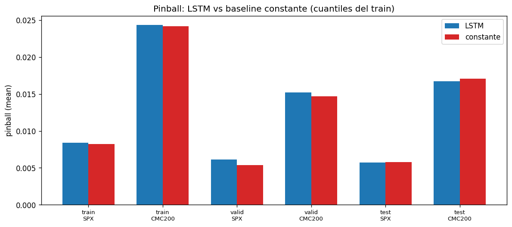

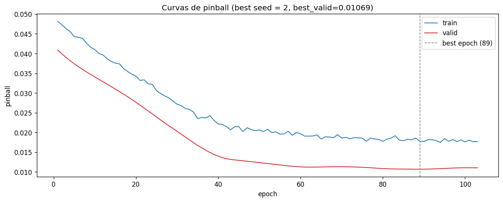

Lectura de `1_pinball_vs_baseline.csv`:

| split | asset | pinball LSTM | pinball baseline | **skill** |
|---|---|---:|---:|---:|
| train | SPX | 0.00843 | 0.00822 | -0.026 |
| train | CMC200 | 0.02438 | 0.02416 | -0.009 |
| **valid** | SPX | 0.00611 | 0.00539 | **-0.132** |
| **valid** | CMC200 | 0.01524 | 0.01471 | **-0.036** |
| test | SPX | 0.00572 | 0.00577 | +0.008 |
| test | CMC200 | 0.01675 | 0.01708 | +0.020 |

Skill = 1 - pinball_LSTM / pinball_baseline.

- En **validation** la LSTM es **peor** que el baseline naive (-13% para SPX, -3.6% para CMC).
- En **test** es marginalmente mejor (+0.8% / +2%) — el "ganador del sweep" se basó en estos 2-3 bps.
- La sweep eligió un modelo cuya ventaja existe solo en el segmento de test final.

### Hallazgo 2 — μ_DL anti-correlaciona con la realidad

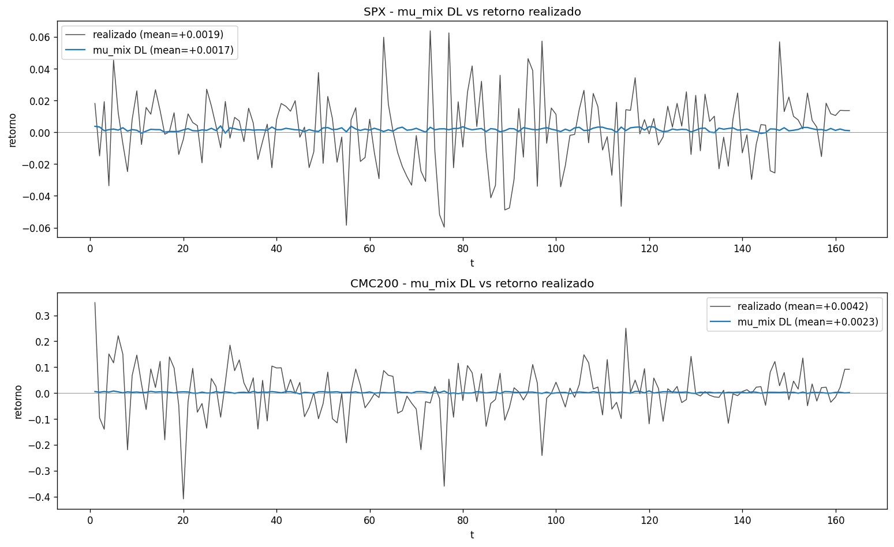

Lectura de `inspeccion/inputs_out/3_mu_vs_realizado.csv`:

| asset | μ_DL mean | realiz mean | bias | hit_rate signo | **corr(μ_DL, realiz)** |
|---|---:|---:|---:|---:|---:|
| SPX | +0.171% | +0.187% | -0.0017% | 53.4% | **-0.030** |
| CMC200 | +0.227% | +0.420% | -0.193% | 49.7% | **-0.133** |

- `corr(μ_DL, real) = -0.13` para CMC200 → cuando la LSTM espera retorno alto, en promedio el realizado es bajo.
- `hit_rate_signo = 49.7%` para CMC ≈ tirar una moneda.
- **El LSTM no predice timing — anti-predice** (especialmente para CMC).

> Esto es lo que rompe el resto del pipeline: el optimizador confia en una
> μ(t) que sistematicamente se equivoca de direccion.

---

## 2) Capa de regimen — p_bull(t)

### Que hace
Convierte los 5 deciles predichos en una probabilidad de "bull" mediante
`p_bull(t) = fraccion de deciles ≥ BULL_THRESHOLD (=0.0)`. Esto se usa para
diagnóstico (no entra al FO bajo la arquitectura post-unificacion).

### Salidas
- `inspeccion/regimen_out/1_pbull_walking_vs_rollout.png` — walking vs rollout autoregresivo.
- `inspeccion/regimen_out/2_pbull_serie_dist.csv` — serie y distribucion.
- `inspeccion/regimen_out/3_rollout_step_by_step.png` — deciles paso a paso del rollout.
- `inspeccion/regimen_out/4_sensibilidad_threshold.png` — variando `BULL_THRESHOLD`.
- `inspeccion/regimen_out/5_calibracion_deciles.png` — diagonal de calibracion.
- `inspeccion/regimen_out/6_sesgo_deciles.png` — histograma realizado vs predicho.

### Hallazgo — p_bull se queda alrededor de 0.5 (sin segregacion)

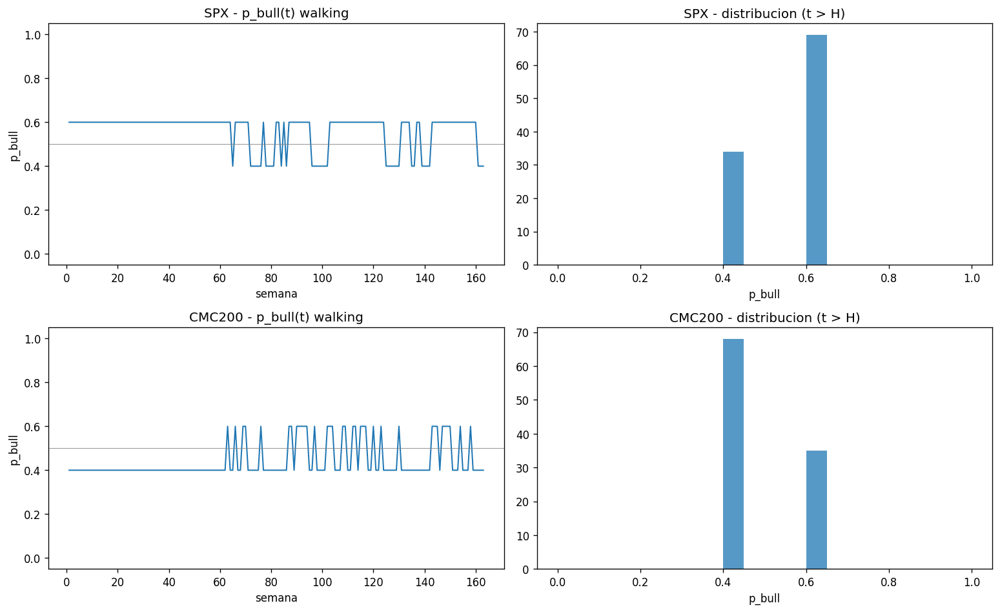

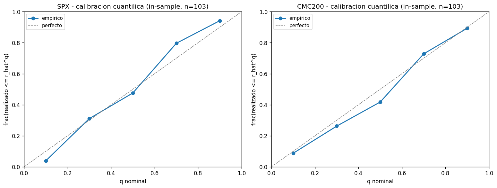

Lectura de `2_pbull_serie_dist.csv`:

| asset | mean | median | frac < 0.2 | frac > 0.8 |
|---|---:|---:|---:|---:|
| SPX | 0.534 | 0.600 | 0% | 0% |
| CMC200 | 0.468 | 0.400 | 0% | 0% |

- p_bull oscila entre 0.4 y 0.6, nunca llega a extremos.
- No hay un "modo bear" claro ni un "modo bull" claro.
- Esto es consecuente con el hallazgo de la LSTM: si la prediccion es mala,
  los deciles quedan repartidos cerca del 0 y p_bull se centra.

> Nota: bajo la arquitectura actual `mu_mix` viene de los **candidatos** del
> LSTM, no de `p_bull * mu_hat_historico`. p_bull queda como diagnostico y
> no afecta el resultado del optimizador. Pero su falta de segregacion es
> otro síntoma de que la LSTM no captura régimen.

---

## 3) Capa de escenarios — los 5 representativos

### Que hace
1. Genera `N_CANDIDATES=1000` trayectorias autoregresivas de largo `T_HORIZON=163` muestreando deciles independientes por activo.
2. Las ordena por cumret terminal del `SUMMARY_ASSET=SPX` y toma la **mediana** de cada quintil → 5 representativos.

### Salidas
- `inspeccion/escenarios_out/1_sesgo_cumret_terminal.csv` — cumret terminal de candidatos vs reps vs histórico.
- `inspeccion/escenarios_out/2_dispersion_fan.png` — fan chart.
- `inspeccion/escenarios_out/3_correlacion_cross_asset.csv` — corr(SPX, CMC) por escenario.
- `inspeccion/escenarios_out/4_path_dependence.csv` — momentos por bloque temporal.
- `inspeccion/escenarios_out/5_sesgo_resumen.csv` — cumret terminal por rep.
- `inspeccion/escenarios_out/6_sanity_seeds.png` — reproducibilidad inter-seed.

### Hallazgo 1 — sesgo de cumret terminal

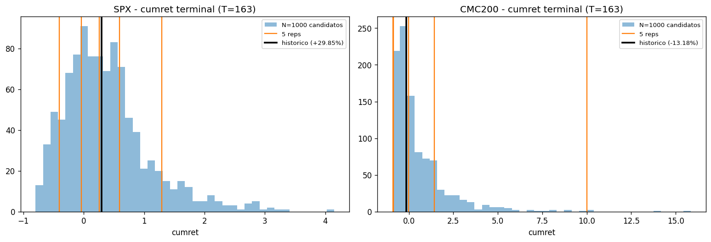

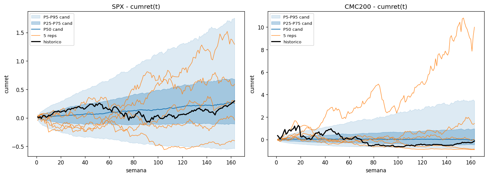

Lectura de `1_sesgo_cumret_terminal.csv`:

| asset | grupo | n | mean cumret | median | std | min | max |
|---|---|---:|---:|---:|---:|---:|---:|
| SPX | candidatos | 1000 | +0.381 | +0.259 | 0.71 | -0.80 | +4.15 |
| SPX | reps_5 | 5 | +0.342 | +0.260 | 0.58 | -0.40 | +1.29 |
| SPX | **historico** | 1 | **+0.298** | — | — | — | — |
| CMC200 | candidatos | 1000 | +0.516 | -0.028 | 1.65 | -0.93 | +15.86 |
| CMC200 | reps_5 | 5 | **+1.932** | -0.012 | 4.12 | -0.90 | **+9.996** |
| CMC200 | **historico** | 1 | **-0.132** | — | — | — | — |

**SPX**: candidatos y reps relativamente alineados con el histórico (+0.38 / +0.34 / +0.30). Tolerable.

**CMC200**: catástrofe.
- candidatos: mean +52%, **max +1586%**, std 165%.
- reps_5: mean **+193%**, max +999%.
- realidad: **-13.2%**.

El problema: la cola derecha de los candidatos (un 1% de trayectorias con
cumret > +500%) sobrevive a la reduccion por quintiles porque arrastra la
mediana del quintil superior.

### Hallazgo 2 — los 5 reps por quintil

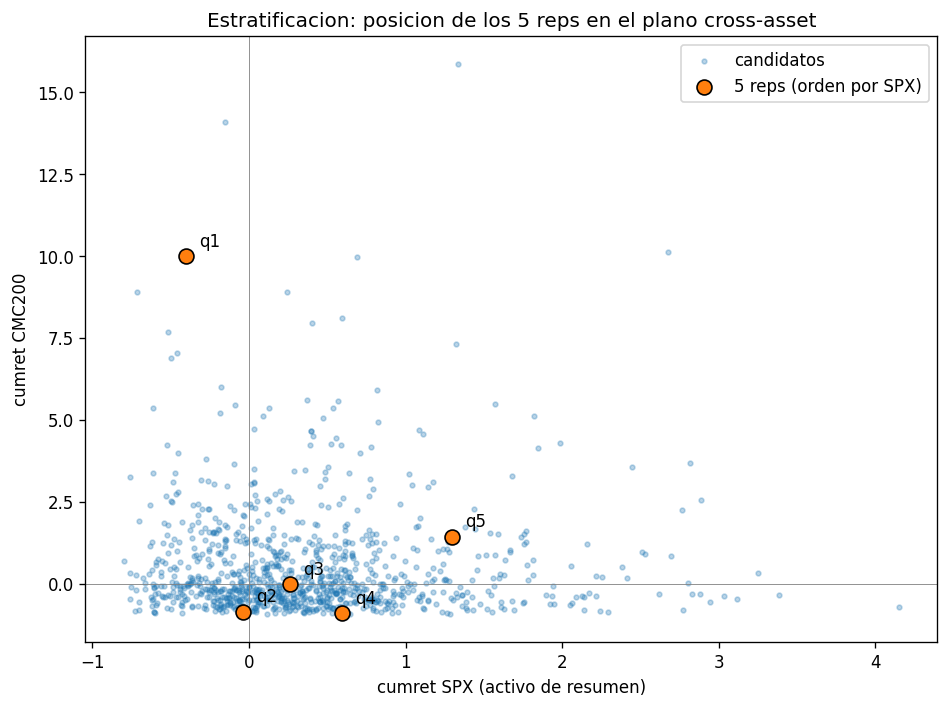

Lectura de `5_sesgo_resumen.csv`:

| rep | cumret SPX | cumret CMC200 |
|---:|---:|---:|
| 1 (Q1) | -0.402 | **+9.996** |
| 2 (Q2) | -0.038 | -0.857 |
| 3 (Q3) | +0.260 | -0.012 |
| 4 (Q4) | +0.594 | -0.896 |
| 5 (Q5) | +1.294 | +1.429 |

> **El rep "más bearish" para SPX (Q1) es el más bullish para CMC**:
> CMC sube +1000% en una trayectoria que para SPX baja -40%. No hay
> correlacion entre los rankings.

### Hallazgo 3 — la cross-corr historica desaparece

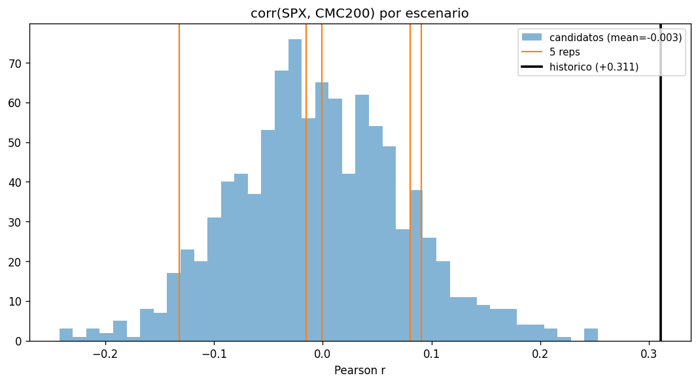

Lectura de `3_correlacion_cross_asset.csv` (extracto):

- 1000 candidatos: corr(SPX_t, CMC_t) distribuida alrededor de 0 (mediana ≈ 0).
- 5 reps: corrs entre -0.13 y +0.09.
- **Historico**: **+0.31**.

El sampling decoupled (`q` independiente por activo, fix del bug 3.1) elimina
la comonotonicidad pero **también elimina la dependencia real** entre SPX y
CMC. El optimizador ve dos activos casi independientes y "diversifica" entre
ellos como si la corr fuera 0.

### Hallazgo 4 — sin estructura temporal

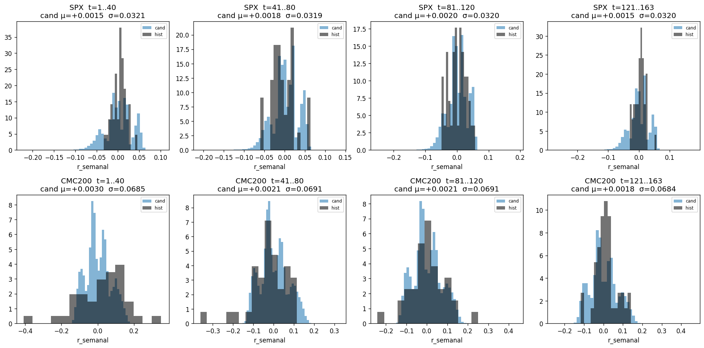

Lectura de `4_path_dependence.csv`:

| asset | bloque | cand_mean | cand_std | hist_mean | hist_std |
|---|---|---:|---:|---:|---:|
| SPX | t=1..40 | +0.153% | 3.21% | +0.391% | 1.59% |
| SPX | t=41..80 | +0.181% | 3.19% | -0.320% | 2.86% |
| SPX | t=81..120 | +0.196% | 3.20% | +0.169% | 2.76% |
| SPX | t=121..163 | +0.153% | 3.20% | +0.487% | 1.68% |
| CMC | t=1..40 | +0.302% | 6.85% | +2.229% | 13.6% |
| CMC | t=41..80 | +0.213% | 6.91% | -2.624% | 9.08% |
| CMC | t=81..120 | +0.214% | 6.91% | +0.691% | 8.72% |
| CMC | t=121..163 | +0.182% | 6.84% | +1.315% | 5.36% |

- **Candidatos**: media y std prácticamente **constantes en t** (~0.2%/sem, ~3.2% std para SPX).
- **Histórico**: oscila claramente (SPX: +0.39 → -0.32 → +0.17 → +0.49; CMC vuela de -2.6% a +2.2%).
- Los candidatos son **ruido i.i.d. estacionario** con drift positivo. No tienen regímenes ni momentum.

> Consecuencia: la μ_mix(t) que ve el optimizador parece variable pero
> en realidad es ruido muestral alrededor de una constante. Cualquier
> "timing" que la política intente capturar es timing falso.

---

## 4) Inputs al optimizador — μ_mix(t), Σ_mix(t)

### Que hace
`build_dl_context` toma los 1000 candidatos y calcula:
- `mu_mix(i, t) = mean_n candidates[n, t, i]`
- `sigma_mix(i, j, t) = cov_n(candidates[n, t, i], candidates[n, t, j])`
Y estos son los inputs que entran a `solve_portfolio` (la FO se construye con ellos).

### Salidas
- `inspeccion/inputs_out/1_mu_mix_serie.csv` / `.png` — serie temporal de μ(t).
- `inspeccion/inputs_out/2_sigma_serie.csv` / `.png` — serie temporal de σ(t).
- `inspeccion/inputs_out/3_mu_vs_realizado.csv` — ya citado.
- `inspeccion/inputs_out/4_psd_check.csv` — chequeo PSD de Σ(t).
- `inspeccion/inputs_out/5_risk_return.csv` — Sharpe implícito.
- `inspeccion/inputs_out/6_coherencia_ex_ante_ex_post.csv` — coherencia mu_mix vs scenarios.
- `inspeccion/inputs_out/6_constantes_del_context.csv` — V_max, w0, c_base.

### Hallazgo 1 — Sharpe implícito infla CMC200

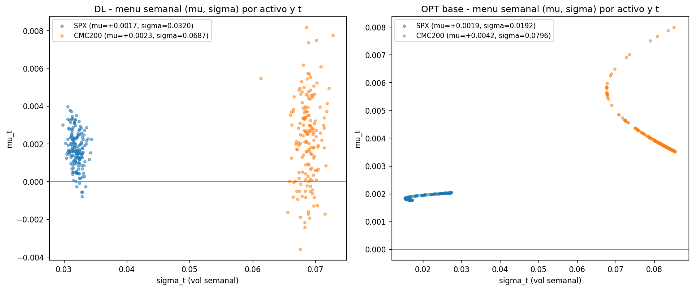

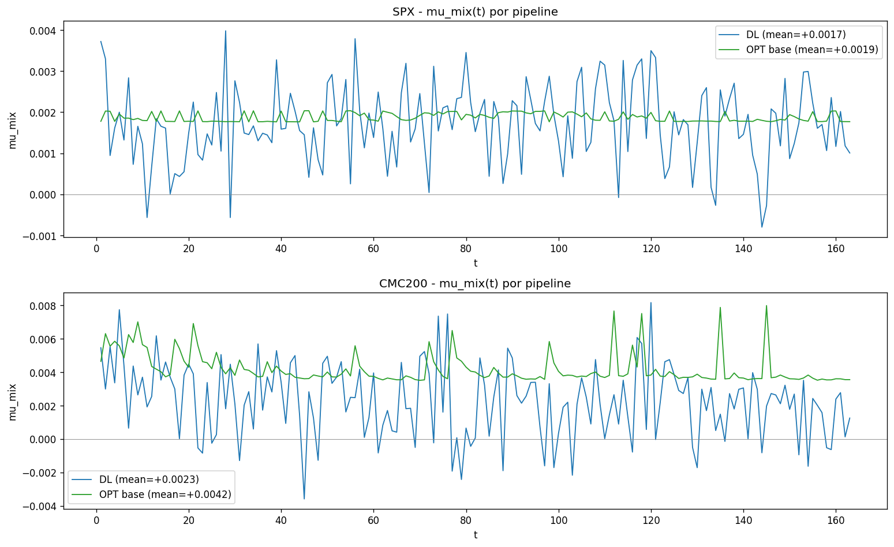

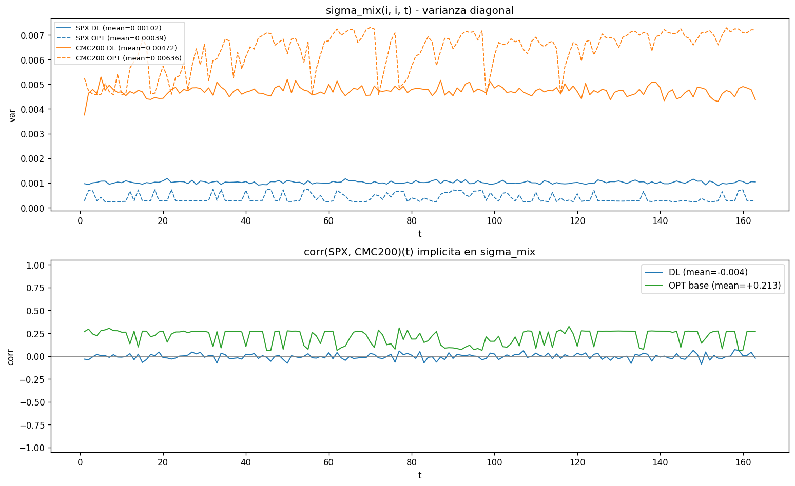

Lectura de `5_risk_return.csv`:

| src | asset | σ mean | μ mean | Sharpe imp |
|---|---|---:|---:|---:|
| **DL** | SPX | 3.20% | +0.171% | +0.053 |
| **DL** | CMC200 | **6.87%** | +0.227% | **+0.033** |
| OPT base | SPX | 1.92% | +0.187% | +0.097 |
| OPT base | CMC200 | 7.96% | +0.420% | +0.053 |

- σ_DL(CMC) = 6.87%/sem vs OPT base (histórico) σ(CMC) = 7.96% → **DL subestima volatilidad de CMC en 14%**.
- μ_DL(CMC) = +0.23%/sem (positivo, atractivo) vs realidad realizada ≈ negativo.
- Sharpe DL(CMC) positivo → optimizador lo ve **comprable**.

> Compara con la config anterior (h24/l2): allí μ_CMC predicho era negativo,
> forzando corner solution w=(1,0). El cambio a h16/l1 **eliminó la solución
> trivial pero introdujo over-allocation a CMC**.

### Hallazgo 2 — gap ex-ante / ex-post pequeño (ok)

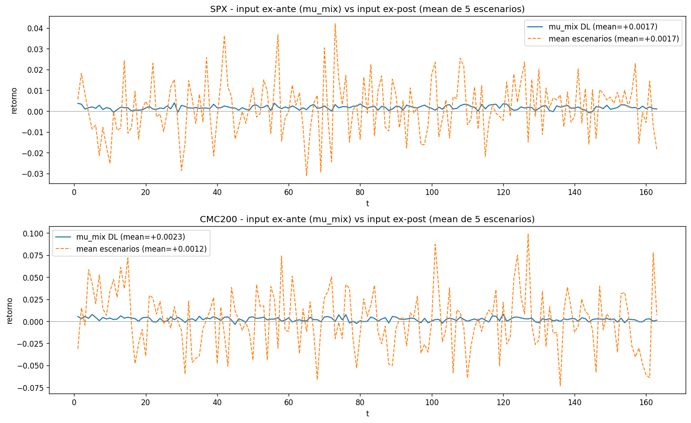

Lectura de `6_coherencia_ex_ante_ex_post.csv`:

| asset | μ_mix DL mean | scenarios mean | gap | corr(μ, scen) |
|---|---:|---:|---:|---:|
| SPX | +0.171% | +0.168% | -0.0024% | +0.145 |
| CMC200 | +0.227% | +0.118% | -0.109% | +0.220 |

- El gap entre lo que ve el FO (`mu_mix`) y lo que viven los escenarios es
  pequeño (~1 bp/sem para SPX, ~10 bp/sem para CMC). La unificación del
  pipeline está funcionando.
- **Pero** `corr(μ_mix, scen)` ≈ 0.14–0.22: el ranking de pasos donde μ_mix
  predice alto no coincide bien con el ranking de pasos donde los escenarios
  realizan alto. Refuerza el hallazgo de timing roto.

### Hallazgo 3 — Σ(t) es PSD (no es el problema)

Lectura de `4_psd_check.csv`:

| src | min eigenvalue | frac t negativo |
|---|---:|---:|
| DL | +0.00089 | 0.0% |
| OPT | +0.00022 | 0.0% |

Σ_mix(t) es positiva definida en todos los t → no hay descomposicion mala
desde el lado matemático. El problema está en su **calibracion**, no su
estructura.

### Hallazgo 4 — constantes razonables

Lectura de `6_constantes_del_context.csv`:

- `V_max = 0.000646` (calculado como `Var(r_SPX_hist) * V_MAX_BUFFER=1.2`).
- `Capital_inicial = $10,000`.
- `c_base = {SPX: 0.001, CMC200: 0.004}`.
- `w0 = {SPX: 0.5, CMC200: 0.5}`.

Estos valores son los del problema base, no son la causa del problema.

---

## 5) Capa optimizador — politicas y turnover

### Que hace
Para cada `g = (λ, m)` del grid (`LAMBDA_GRID × M_GRID = 5×3 = 15` puntos),
GAMSPy + IPOPT resuelve:

```
max  z = Σ_t [ Σ_i w(i,t)·μ_mix(i,t)
              - λ·(Σ_{ij} w_i·w_j·σ_mix(i,j,t) - V_max)
              - c_base·m·Σ_i (u(i,t) + v(i,t)) ]
s.t. Σ_i w(i,t) = 1,
     w(i,t) - w(i,t-1) = u(i,t) - v(i,t),  t > 1,
     w(i,1) - w0(i)    = u(i,1) - v(i,1).
```

### Salidas
- `inspeccion/grid_out/1_regret_heatmap.png` / `1_regret_table.csv` — regret por (λ, m, escenario).
- `inspeccion/grid_out/2_V_heatmap.png` / `2_V_table.csv` — capital terminal por (λ, m, escenario).
- `inspeccion/grid_out/3_boundary_extended.png` / `3_boundary_seleccion.csv` — selección y bordes.
- `inspeccion/grid_out/4_politicas_w.png` / `.csv` — w(i, t) por (λ, m).
- `inspeccion/grid_out/5_turnover.csv` / `.png` — turnover total.
- `inspeccion/grid_out/6_dl_vs_optbase.csv` / `.png` — V por escenario, DL vs OPT base.

### Hallazgo 1 — turnover explota en el rincón sin fricción

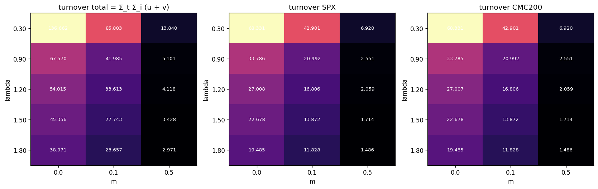

Lectura de `5_turnover.csv` (extracto):

| λ | m | turnover total | turnover SPX | turnover CMC |
|---:|---:|---:|---:|---:|
| 0.30 | **0.01** | **136.66** | 68.33 | 68.33 |
| 0.30 | 0.10 | 85.80 | 42.90 | 42.90 |
| 0.30 | 0.50 | 13.84 | 6.92 | 6.92 |
| 0.90 | 0.01 | 67.57 | 33.79 | 33.78 |
| 1.20 | 0.50 | 4.12 | 2.06 | 2.06 |
| 1.80 | 0.50 | 2.97 | 1.49 | 1.49 |

- 163 semanas, turnover 136 → ~85% rotación semanal en el peor rincón.
- Comparar con la config anterior (h24/l2) donde turnover ≈ 1.0 para todo (λ, m) — sólo el rebalanceo inicial w0=(0.5,0.5)→(1,0).
- En la config actual la política **salta entre SPX↔CMC casi cada semana** intentando perseguir la μ_mix(t) variable (que es ruido).

### Hallazgo 2 — politicas oscilantes

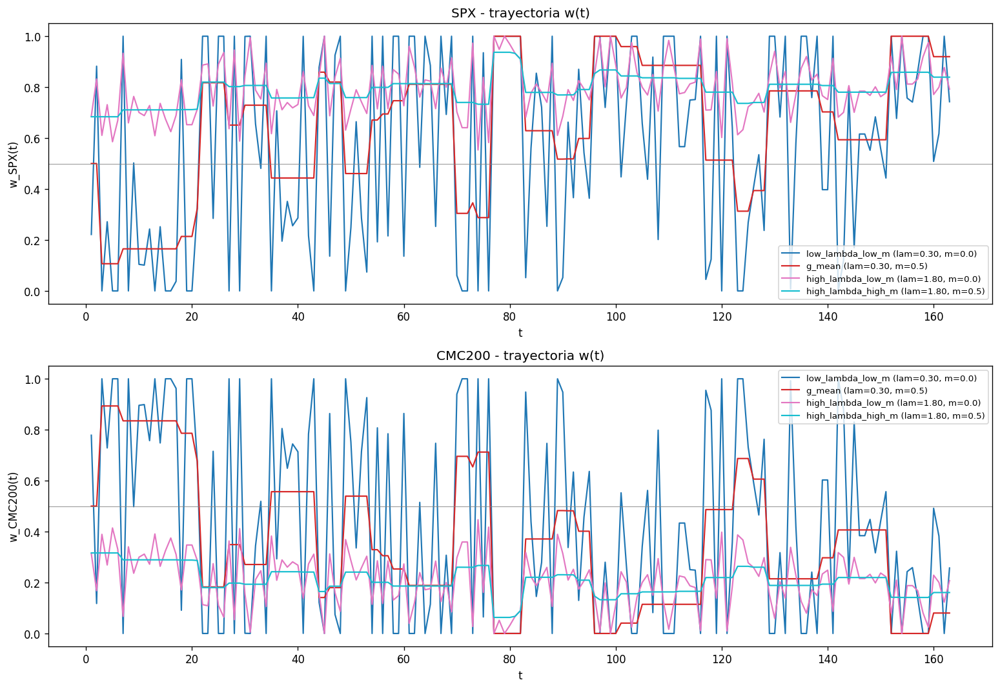

Cada línea de la grafica es una política w_SPX(t) para un (λ, m) distinto.
- Para λ=0.3, m=0.01: salta entre 0 y 1 cada paso.
- Para λ=1.8, m=0.5: línea casi plana cerca de 0.4–0.6.
- La regularizacion por λ (riesgo) y por m (costo) tiene que estar **alta** para domesticar la política.

#### Como se rebalancea el portafolio en el tiempo

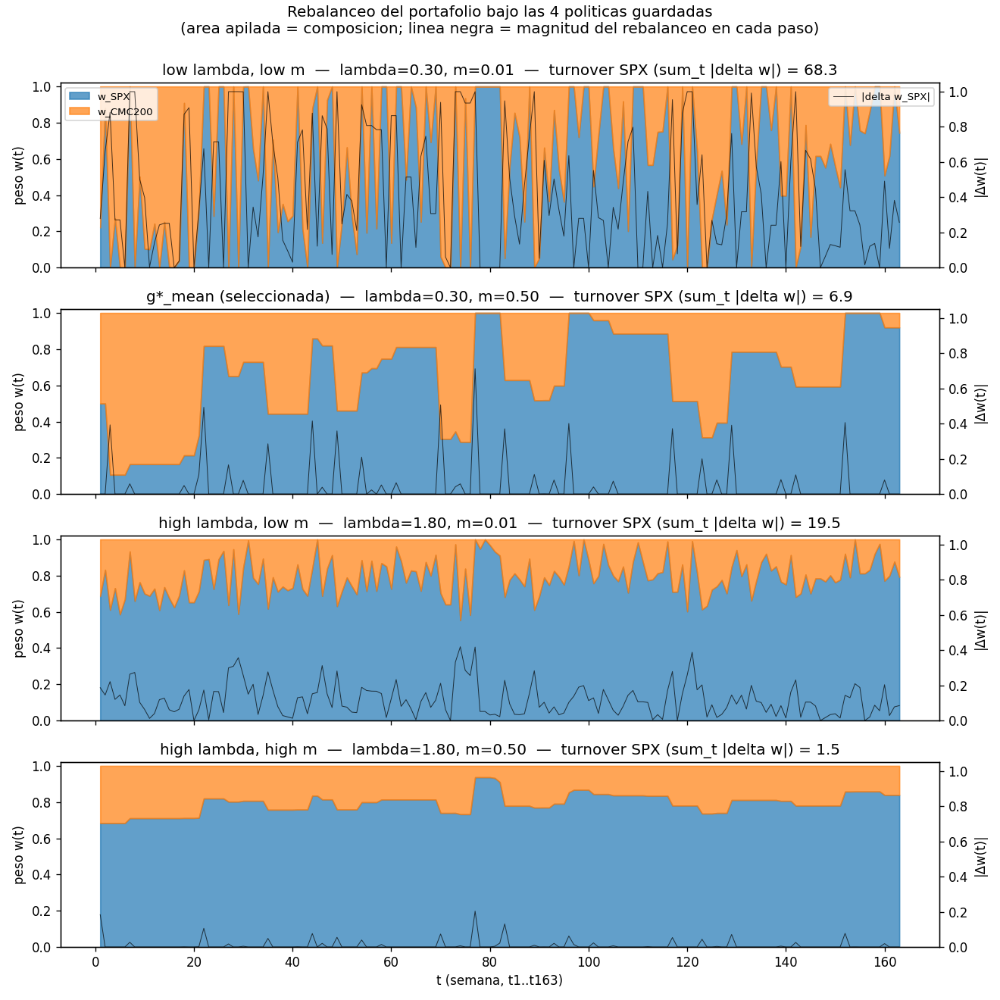

Panel 4x1 con la composicion del portafolio (area apilada: azul = SPX,
naranja = CMC200; suma 1 en cada t) y la magnitud del rebalanceo por paso
(linea negra = |Δw_SPX(t)|, eje derecho):

- **`low lambda, low m`** (λ=0.30, m=0.01): rebalanceo total ≈ 68. El portafolio salta de 100% SPX a 100% CMC casi cada semana. Es la política mas patologica del grid — explota el rincón cost-free.
- **`g*_mean (seleccionada)`** (λ=0.30, m=0.50): rebalanceo ≈ 6.9. La penalizacion por costo (`m=0.5`) la domestica bastante; mantiene tramos de SPX/CMC estables y rebalancea ocasionalmente.
- **`high lambda, low m`** (λ=1.80, m=0.01): rebalanceo ≈ 19.5. λ alto reduce la apuesta pero m=0.01 sigue permitiendo movimientos frecuentes.
- **`high lambda, high m`** (λ=1.80, m=0.50): rebalanceo ≈ 1.5. Practicamente buy-and-hold a un 50/50 ligeramente sesgado.

Lectura: **el rebalanceo del portafolio depende dramaticamente de m** (el
costo de transaccion penalizado en la FO). Sin penalizacion (m=0.01) la
politica responde a cada flicker de μ(t) — y como esa μ(t) es ruido del
LSTM, el resultado son rotaciones erradas. Con m=0.5 la politica se
estabiliza pero ya no aprovecha (real o falsamente) ninguna señal de timing.

### Hallazgo 3 — el optimo cae en el borde del grid

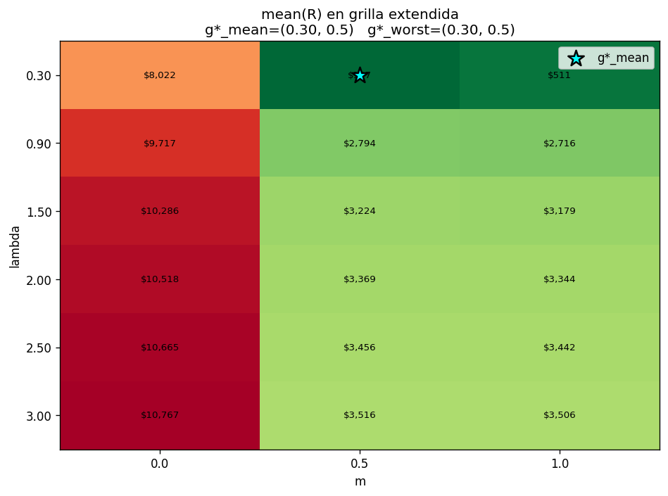

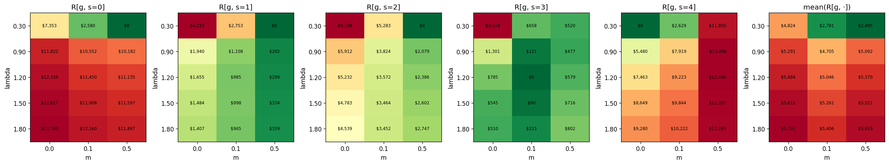

Lectura de `3_boundary_seleccion.csv` y warning del run:

```
g*_mean cae en frontera del grid (lambda=0.30, m=0.50)
g*_worst cae en frontera del grid (lambda=0.30)
```

- g*_mean = (λ=0.30, m=0.50) → el grid podria querer todavia menos λ o más m.
- El grid actual (LAMBDA_GRID = 0.3..1.8, M_GRID = 0.01..0.5) no contiene el verdadero óptimo.

---

## 6) V[g, s] — dispersion entre escenarios

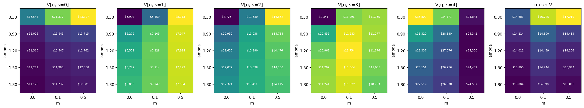

### Lectura de `2_V_table.csv` / `2_V_heatmap.png`

Para cada `g` el optimizador devuelve **una** política, pero la simulación
sobre los 5 escenarios produce 5 capitales terminales muy distintos.

Ejemplo para g*_mean = (λ=0.30, m=0.50):

| escenario | V terminal | retorno |
|---:|---:|---:|
| s=0 | $23,897 | +138.9% |
| s=1 | $8,213 | -17.9% |
| s=2 | $16,862 | +68.6% |
| s=3 | $11,235 | +12.3% |
| s=4 | $24,845 | +148.5% |
| **mean** | **$17,010** | **+70.1%** |
| **worst** | **$8,213** | **-17.9%** |

> Rango $8k–$25k (factor 3×) para la **misma** política. El óptimo "promedio"
> oculta que en el peor escenario perdes 18% y en el mejor ganas 150%. La
> apuesta es de timing puro — depende totalmente de cual de las 5
> trayectorias se materializa.

### Lectura de `6_dl_vs_optbase.csv` — comparación DL vs OPT base

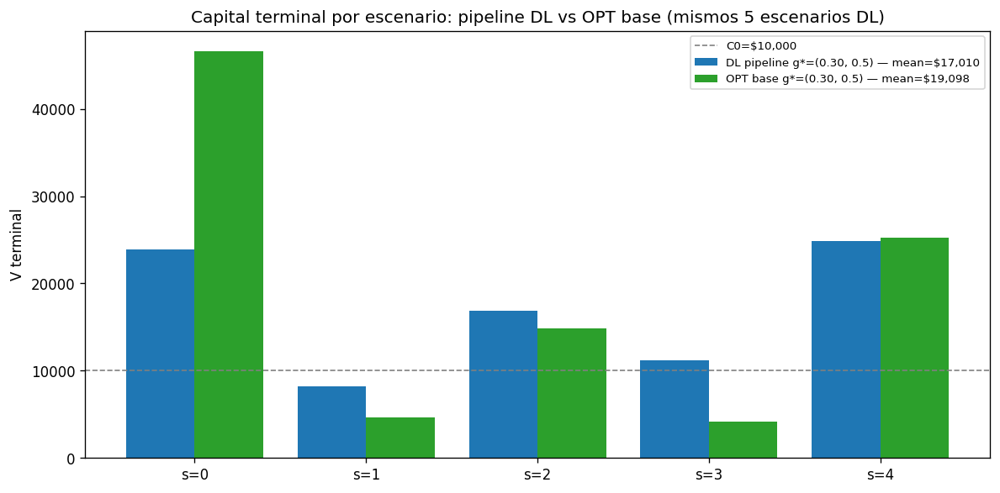

| escenario | V DL | V OPT base | Δ (DL - base) | ret DL | ret base |
|---:|---:|---:|---:|---:|---:|
| s=0 | $23,897 | $46,621 | -22,723 | +139% | +366% |
| s=1 | $8,213 | $4,622 | +3,591 | -18% | -54% |
| s=2 | $16,862 | $14,860 | +2,002 | +69% | +49% |
| s=3 | $11,235 | $4,135 | +7,100 | +12% | -59% |
| s=4 | $24,845 | $25,252 | -407 | +148% | +153% |
| **mean** | $17,010 | $19,098 | -2,087 | +70% | +91% |
| **worst** | $8,213 | $4,135 | +4,078 | -18% | -59% |

- En **promedio** OPT base supera a DL (+91% vs +70%).
- En **peor escenario** DL es mejor (-18% vs -59%): por eso el regret minimax
  podría elegir DL.
- Pero la dispersion sigue siendo enorme en ambos.

---

## 7) Backtest historico — la prueba final

### Lectura de `inspeccion/grid_out/6_dl_vs_optbase.png` + run log

Aplicando la política `w*_mean` de DL (λ=0.30, m=0.50) a los retornos
**realizados** (no a escenarios):

| Politica | V hist final | retorno acumulado |
|---|---:|---:|
| OPT base (λ=1, m=1) | ~$10,500 | ~+5% |
| Naive BH 50/50 | ~$12,000 | ~+20% |
| Naive RB 50/50 | ~$12,500 | ~+25% |
| **Regret-Grid DL g*_mean** | **~$8,519** | **-14.8%** |

> El modelo "óptimo" según el regret-grid sobre escenarios DL **pierde** sobre
> realidad, peor que las dos naive. Es el sintoma final de la cascada: la
> política responde a una μ(t) ficticia y rota a destiempo.

---

## Sintesis — donde esta el problema raiz

| Nivel | Es el cuello de botella? | Evidencia |
|---|---|---|
| LSTM aislada (pinball loss) | ✓ ganador del sweep | skill +0.014 |
| LSTM downstream | ✗ falla | corr(μ, real) = -0.13 para CMC |
| Régimen | ✗ no segrega | p_bull centrado en 0.5 |
| Escenarios magnitud (media) | ✗ sesgo extrapolacion | reps CMC +193% vs hist -13% |
| Escenarios timing | ✗ no captura regímenes | candidatos planos en t |
| Escenarios diversificacion | ✗ corr cruzada ≈ 0 | vs hist +0.31 |
| Inputs PSD | ✓ ok | min eig > 0 |
| Inputs Sharpe CMC | ✗ inflado | σ subestimada, μ positiva |
| Optimizador (FO) | ✓ formula correcta | matemáticamente |
| Optimizador (grid) | ✗ óptimo en borde | g* = (0.30, 0.50) |
| Política | ✗ over-fitea al timing | turnover 137 |
| Backtest hist | ✗ pierde 15% | $8,519 vs $12k naive |

**El cuello de botella central**: el sweep que eligió `h16/l1` optimizó la
pinball loss del LSTM aislado, pero la pinball loss **no penaliza** el
hecho de que `corr(μ_DL, realizado) = -0.13`. Un modelo puede tener mejor
pinball en promedio (deciles más ajustados a la distribucion marginal) y
peor timing (orden de los t en que predice alto vs el orden real). El
downstream — donde el optimizador apuesta direcionalmente paso a paso —
necesita **lo segundo**, no lo primero.

---

## Caminos plausibles (para discutir)

1. **Rehacer la sweep con metrica downstream.** En vez de pinball, usar
   regret promedio o V_terminal de un backtest historico leave-one-window-out.
   Es la solucion principial pero la mas cara (entrenar 12+ modelos x N
   windows). Ataca la causa raiz.

2. **Shrinkage de μ_DL hacia μ_hat.** Pull la media marginal de los
   candidatos hacia el promedio historico. No requiere reentrenar. Riesgo:
   ataca solo la magnitud, no el timing (la corr -0.13 sigue).

3. **Restringir el grid de m por abajo** (m_min ≥ 0.1, idealmente más alto).
   Mecánico, mata el rincón cost-free donde la política explota. No arregla
   el modelo, solo evita el escenario peor.

4. **Volver a h24/l2.** Aceptar el corner solution trivial. Política w=(1,0)
   estable y backtest histórico mejor que h16/l1 (no es positivo pero al
   menos no pierde 15%). Implica admitir que la LSTM no aporta señal útil
   en el dataset actual.

5. **Aplanar μ_mix(t) en el tiempo** (constante = mean_t). Elimina la
   "señal" de timing falso. La política se vuelve un MV estatico. Es un
   experimento diagnóstico — si esto **mejora** el backtest, confirma que
   el timing es el problema.

Ninguna de las 5 se ha corrido todavia en esta sesion. Para cualquier
camino que elijas se requiere autorizacion explicita.
